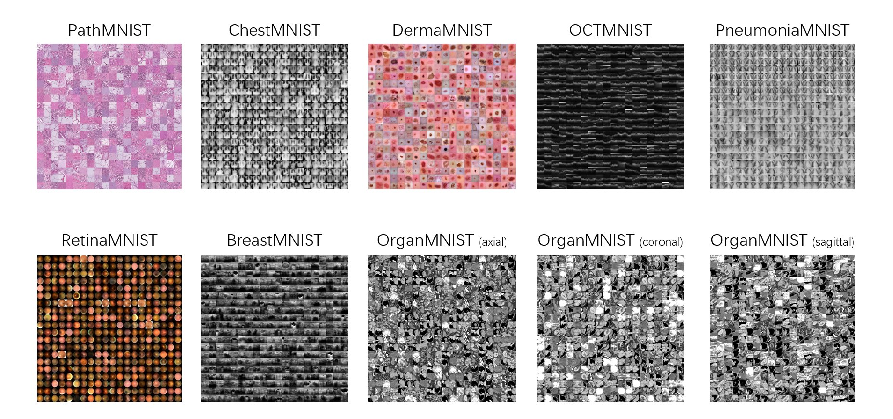

# MedMNIST 
## [arXiv Preprint](https://arxiv.org/abs/2010.14925) | [Project Page](https://medmnist.github.io/) | [Dataset](#dataset)
[Jiancheng Yang](https://jiancheng-yang.com/), Rui Shi, [Bingbing Ni](https://scholar.google.com/citations?user=eUbmKwYAAAAJ), [Bilian Ke](https://scholar.google.com/citations?user=2cX5y8kAAAAJ)

We present *MedMNIST*, a collection of 10 pre-processed medical open datasets. MedMNIST is standardized to perform classification tasks on lightweight 28 * 28 images, which requires no background knowledge. Covering the primary data modalities in medical image analysis, it is diverse on data scale (from 100 to 100,000) and tasks (binary/multi-class, ordinal regression and multi-label). MedMNIST could be used for educational purpose, rapid prototyping, multi-modal machine learning or AutoML in medical image analysis. Moreover, MedMNIST Classification Decathlon is designed to benchmark AutoML algorithms on all 10 datasets. 



For more details, please refer to our paper:

**MedMNIST Classification Decathlon: A Lightweight AutoML Benchmark for Medical Image Analysis** ([arXiv](https://arxiv.org/abs/2010.14925))

# Key Features
* ***Educational***: Our multi-modal data, from multiple open medical image datasets with Creative Commons (CC) Licenses, is easy to use for educational purpose.
* ***Standardized***: Data is pre-processed into same format, which requires no background knowledge for users.
* ***Diverse***: The multi-modal datasets covers diverse data scales (from 100 to 100,000) and tasks (binary/multiclass, ordinal regression and multi-label).
* ***Lightweight***: The small size of 28 × 28 is friendly for rapid prototyping and experimenting multi-modal machine learning and AutoML algorithms.

Please note that this dataset is **NOT** intended for clinical use.

# Code Structure
* [`medmnist/`](medmnist/):
    * [`dataset.py`](medmnist/dataset.py): dataloaders of medmnist.
    * [`models.py`](medmnist/models.py): *ResNet-18* and *ResNet-50* models.
    * [`evaluator.py`](medmnist/evaluator.py): evaluate metrics.
* [`train.py`](train.py): the training script.

# Requirements
The code requires only common Python environments for machine learning; Basicially, it was tested with
* Python 3 (Anaconda 3.6.3 specifically)
* PyTorch\==0.3.1
* numpy\==1.18.5, pandas\==0.25.3, scikit-learn\==0.22.2, tqdm

Higher (or lower) versions should also work (perhaps with minor modifications).


# Dataset

You could download the dataset(s) via the following free accesses:

* [zenodo.org](https://doi.org/10.5281/zenodo.4269852) (recommended): You could also use our code to download the datasets from zenodo.org automatically.
* [Google Drive](https://drive.google.com/drive/folders/1Tl_SP-ffDQg-jDG_EWPlWKgZTmGbvFXU?usp=sharing)
* [百度网盘](https://pan.baidu.com/s/1bgPbESbLOlUSu4QC-4O46g) (code: gx6i)

The dataset contains ten subsets, and each subset (e.g., `pathmnist.npz`) is comprised of `train_images`, `train_labels`, `val_images`, `val_labels`, `test_images` and `test_labels`.

# How to run the experiments

* Download Dataset.

* Run the demo code [`train.py`](./train.py) script in terminal. 

  First, change directory to where [`train.py`](./train.py) locates. Then, use command `python train.py --data_name xxxmnist --input_root input_root --output_root output_root --num_epoch 100 --download True` to run the experiments, where `xxxmnist` is subset of our MedMNIST (e.g., `pathmnist`), `input_root` is the path of the data files, `output_root` is the folder to save the results, `num_epoch` is the number of epochs of training, and `download` is the bool value whether download the dataset. 

  To run PathMNIST

  ```
  python train.py --data_name pathmnist --input_root input --output_root output --num_epoch 100 --download True
  ```

  

# Citation
If you find this project useful, please cite our paper as:

      Jiancheng Yang, Rui Shi, Bingbing Ni. "MedMNIST Classification Decathlon: A Lightweight AutoML Benchmark for Medical Image Analysis," arXiv preprint arXiv:2010.14925, 2020.

or using bibtex:
     
     @article{medmnist,
     title={MedMNIST Classification Decathlon: A Lightweight AutoML Benchmark for Medical Image Analysis},
     author={Yang, Jiancheng and Shi, Rui and Ni, Bingbing},
     journal={arXiv preprint arXiv:2010.14925},
     year={2020}
     }

# LICENSE
The code is under Apache-2.0 License.
